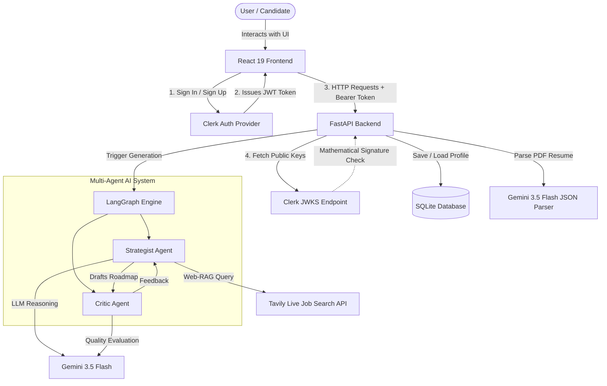

# Intelligent Career Path Advisory Agent for Senior IT Professionals

> Major Capstone Project — Phase 1 | NMIT, VTU | Academic Year 2025–26

**Team:**
- Deepanshu Bisht (1NT23CS056)
- Divya S Karki (1NT23CS067)

**Guide:** DR. HONNARAJU.B, Professor, Dept. of CSE, NMIT

---

## Problem Statement

Existing career platforms like LinkedIn, Naukri, and Glassdoor are optimized for early-career job matching and do not address the complex advisory needs of senior IT professionals. A Senior Engineer with 5+ years of experience navigating transitions into Engineering Management, Technical Architecture, or CTO roles requires personalized, explainable guidance based on real-time market trends — not keyword-based job recommendations.

This project builds an autonomous AI-powered career advisory agent utilizing a Multi-Agent architecture (Strategist and Critic loops), Web-RAG (Retrieval-Augmented Generation via live job market queries), and LLM-based reasoning to deliver highly personalized career progression roadmaps and skill gap analyses.

---

## Functional Requirements

| ID | Requirement | Status |
|----|-------------|--------|
| FR1 | Secure, production-grade user authentication via Clerk (JWKS signature verification) | ✅ Complete |
| FR2 | PDF resume upload with NLP-based semantic parsing to auto-populate user skill profiles | ✅ Complete |
| FR3 | Multi-Agent orchestration (Strategist & Critic) using LangGraph for iterative roadmap generation and quality review | ✅ Complete |
| FR4 | Real-time Web-RAG integrating live job market data (via Tavily Search API) to ground recommendations in current industry demand | ✅ Complete |
| FR5 | Fault-tolerant LLM execution with exponential backoff (`tenacity`) to gracefully handle rate limits and API quotas | ✅ Complete |
| FR6 | Career transition classification (lateral/upward/pivot) + interactive mock interviewer agent | ⬜ Planned (Phase B) |
| FR7 | Mentor matching via cosine similarity over vector-encoded transition profiles | ⬜ Planned (Phase B) |
| FR8 | Long-term episodic memory (Zep/Mem0) for persistent user career tracking | ⬜ Planned (Phase B) |

---

## Tech Stack

| Component | Technology |
|-----------|------------|
| Backend API | Python 3.11, FastAPI |
| Authentication | Clerk (Frontend UI + Backend PyJWKClient validation) |
| Database | SQLite + SQLAlchemy |
| Orchestration | LangGraph, LangChain (Multi-Agent State Machine) |
| LLM | Google Gemini 3.5 Flash (via `langchain-google-genai`) |
| Live Market Search | Tavily Search API (Web-RAG) |
| Resilience | `tenacity` (Exponential backoff for LLM rate limits) |
| Frontend | React 19 + Vite + Tailwind CSS |
| Routing | React Router DOM |
| Version Control | Git + GitHub |

---

## System Architecture

The system operates across a strictly decoupled React Frontend and FastAPI Backend, communicating securely via standard REST conventions and JWKS signature verification.

### High-Level Architecture Diagram



### Detailed Execution Flow

1. **Frontend & Authentication Flow:**
   - The user arrives at the React frontend and clicks "Sign In".
   - **Clerk** handles the entire authentication flow (UI, passwords, social logins) completely independent of our backend.
   - Once successfully logged in, Clerk issues a secure **JSON Web Token (JWT)** to the browser.
   - For every subsequent API call (like generating a roadmap), the React Axios client attaches this JWT as a `Bearer Token` in the Authorization header.

2. **Backend Security Validation:**
   - The FastAPI backend receives the request but does *not* trust it.
   - It executes `get_current_user` in `security.py`, dynamically pinging the Clerk JWKS (JSON Web Key Set) URL to retrieve public cryptographic keys.
   - It performs an RS256 mathematical validation on the token's signature. If valid, the user's database ID is extracted, and the request proceeds to the route handlers.

3. **Resume Parsing & Gap Analysis:**
   - The user uploads a PDF. FastAPI handles the multipart file, extracting the raw text.
   - The text is sent to **Gemini 3.5 Flash** with strict instructions to output JSON.
   - The model isolates Verified Skills, Past Experience, and extracts Missing Market Gaps. 
   - The structured JSON is saved into the **SQLite** database via SQLAlchemy ORM.

4. **LangGraph Multi-Agent Orchestration:**
   - When the user requests a career roadmap, the backend spins up a state-machine using **LangGraph**.
   - **Step 1: The Strategist Agent** analyzes the user's gaps. It makes an API call to **Tavily Search API** (Web-RAG) to find live, current job postings for senior IT roles. It synthesizes this into a Draft Roadmap.
   - **Step 2: The Critic Agent** reviews the Draft Roadmap against strict quality metrics (Are the goals SMART? Is it senior-level appropriate?).
   - **Step 3: The Iterative Loop.** If the Critic rejects the plan, the feedback is sent *back* to the Strategist for a rewrite. Once approved, the state machine halts, and the final Markdown document is returned to the React frontend for display.
   - *Resilience:* All LLM calls within these agents are wrapped with `tenacity`, ensuring that if Google's rate limits (429 errors) are hit, the backend silently pauses and retries via exponential backoff rather than crashing.

---

## Project Structure

```
final_year_project/
├── backend/
│   ├── main.py                  # FastAPI app entry point, CORS config
│   ├── database.py              # SQLAlchemy engine, session
│   ├── models.py                # UserProfile SQLAlchemy model
│   ├── security.py              # Clerk PyJWKClient token verification
│   ├── agent.py                 # LangGraph Multi-Agent Engine (Strategist/Critic)
│   ├── requirements.txt         # Python dependencies
│   └── routers/
│       ├── profile.py           # GET/POST profile, Resume parsing endpoint
│       └── roadmap.py           # Triggers the LangGraph Action Plan generation
├── frontend/
│   └── src/
│       ├── App.jsx              # BrowserRouter, Clerk SignedIn/SignedOut Routes
│       ├── main.jsx             # ClerkProvider initialization
│       ├── pages/
│       │   ├── Login.jsx        # Clerk SignIn component
│       │   ├── Dashboard.jsx    # Displays Verified Skills & Market Gaps
│       │   ├── Assessment.jsx   # PDF Resume upload handler
│       │   └── Roadmap.jsx      # Markdown-rendered final Action Plan
│       └── lib/
│           └── axios.js         # Axios instance for backend communication
├── .gitignore
└── README.md
```

---

## Setup Instructions

### Prerequisites
- Python 3.11+
- Node.js 18+
- A Google Gemini API key from [aistudio.google.com](https://aistudio.google.com/apikey)
- A Tavily API key from [tavily.com](https://tavily.com/)
- A Clerk Account (Publishable Key and Secret Key)

### Backend Setup

```bash
# 1. Clone the repository
git clone https://github.com/nmit-1NT23CS056/final_year_project_agentic.git
cd final_year_project_agentic/backend

# 2. Create and activate virtual environment
python -m venv venv
venv\Scripts\activate  # Windows

# 3. Install dependencies
pip install -r requirements.txt

# 4. Create .env file inside backend/
GEMINI_API_KEY=your_gemini_api_key_here
TAVILY_API_KEY=your_tavily_api_key_here
CLERK_FRONTEND_API=your-clerk-frontend-api.clerk.accounts.dev

# 5. Run the backend server
uvicorn main:app --reload
```

Backend runs at: `http://localhost:8000`

### Frontend Setup

```bash
# In a new terminal
cd frontend
npm install

# Create .env file inside frontend/
VITE_CLERK_PUBLISHABLE_KEY=pk_test_your_clerk_publishable_key

# Start the dev server
npm run dev
```

Frontend runs at: `http://localhost:5173`

---

## Key Design Decisions

- **Multi-Agent Orchestration (LangGraph):** We shifted from a monolithic prompt architecture to a state-machine workflow. The `Strategist` drafts the plan based on live data, while the `Critic` forces revisions if the quality isn't high enough.
- **Web-RAG over Vector Databases:** We removed ChromaDB and static text embeddings in favor of the **Tavily Search API**. Senior IT roles evolve too fast for static datasets. Web-RAG ensures skill gap analysis is grounded in real-time, live job postings.
- **Production-Grade Security:** Replaced local JWT email/password auth with **Clerk**. The FastAPI backend mathematically verifies Clerk's RS256 JWT signatures via `PyJWKClient`, ensuring zero forged requests.
- **Fault Tolerance (`tenacity`):** The Gemini Free Tier has strict rate limits. We wrapped all LLM calls in exponential backoff retry loops. If the API hits a `429 Resource Exhausted`, the backend silently pauses and retries instead of crashing the application.
- **Gemini 3.5 Flash:** Upgraded to the latest Google models for superior reasoning speed, massively expanded free-tier limits, and precise JSON output formatting during resume parsing.
