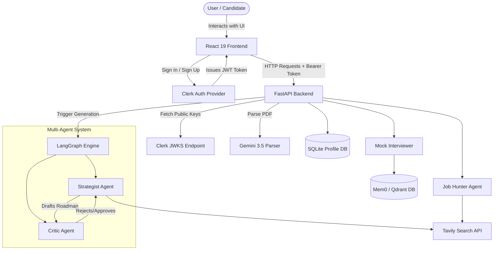

# Intelligent Career Path Advisory Agent for Senior IT Professionals

<div align="center">
  
  
  
  
  
</div>

**Major Capstone Project | NMIT, VTU | Academic Year 2025–26**

**Institution:** Nitte Meenakshi Institute of Technology (NMIT)  
**Project Guide:** DR. HONNARAJU.B, Professor, Dept. of CSE, NMIT  
**Team:** 
- Deepanshu Bisht (1NT23CS056)
- Divya S Karki (1NT23CS067)

---

## ?? Problem Statement
Existing career platforms like LinkedIn, Naukri, and Glassdoor are optimized for early-career job matching and do not address the complex advisory needs of senior IT professionals. A Senior Engineer with 5+ years of experience navigating transitions into Engineering Management, Technical Architecture, or CTO roles requires personalized, explainable guidance based on real-time market trends — not keyword-based job recommendations.

This project builds an autonomous AI-powered career advisory agent utilizing a Multi-Agent architecture (Strategist and Critic loops), Web-RAG (Retrieval-Augmented Generation via live job market queries), and LLM-based reasoning to deliver highly personalized career progression roadmaps and skill gap analyses.

---

## ?? Completed Functional Requirements (FR)

| ID | Requirement | Status |
|---|---|---|
| **FR1** | Secure, production-grade user authentication via Clerk (JWKS signature verification) | ? Complete |
| **FR2** | PDF resume upload with NLP-based semantic parsing to auto-populate user skill profiles | ? Complete |
| **FR3** | Multi-Agent orchestration (Strategist & Critic) using LangGraph for iterative roadmap generation and quality review | ? Complete |
| **FR4** | Real-time Web-RAG integrating live job market data (via Tavily Search API) to ground recommendations in current industry demand and render Data-Driven Dashboard Analytics | ? Complete |
| **FR5** | Autonomous Job Hunter Agent that proactively matches live job descriptions and automatically tailors Cover Letters | ? Complete |
| **FR6** | Interactive AI Mock Interviewer with real-time LLM Token Streaming (Server-Sent Events) | ? Complete |
| **FR8** | Long-term episodic memory (Zep/Mem0 + Qdrant) for persistent user career tracking and proactive mentor recall | ? Complete |

*(Note: FR7 was officially descoped from the final implementation).*

---

## ??? System Architecture

The application runs on a strictly decoupled React Frontend and FastAPI Backend architecture, communicating securely via standard REST conventions and JWKS signature verification.


```mermaid
graph TD
    %% User Interaction
    User([User / Candidate]) -->|Interacts with UI| React[React 19 Frontend]
    
    %% Auth Flow
    React -->|Sign In / Sign Up| ClerkServer[Clerk Auth Provider]
    ClerkServer -->|Issues JWT Token| React
    React -->|HTTP Requests + Bearer Token| FastAPI[FastAPI Backend]
    
    %% Backend Security Validation
    FastAPI -->|Fetch Public Keys| ClerkJWKS[Clerk JWKS Endpoint]
    
    %% AI Pipeline
    FastAPI -->|Parse PDF| GeminiParser[Gemini 3.5 Parser]
    
    %% Multi-Agent Generation Loop
    FastAPI -->|Trigger Generation| LangGraph[LangGraph Engine]
    subgraph Multi-Agent System
        LangGraph --> Strategist[Strategist Agent]
        LangGraph --> Critic[Critic Agent]
        Strategist -->|Drafts Roadmap| Critic
        Critic -->|Rejects/Approves| Strategist
    end
    
    %% Subsystems
    FastAPI --> JobAgent[Job Hunter Agent]
    FastAPI --> InterviewAgent[Mock Interviewer]
    
    %% Tools & DBs
    Strategist --> Tavily[Tavily Search API]
    JobAgent --> Tavily
    InterviewAgent --> Mem0[(Mem0 / Qdrant DB)]
    FastAPI --> SQLite[(SQLite Profile DB)]
```

---

## ?? Setup Instructions

### Prerequisites
- Python 3.10+
- Node.js 18+
- [Google Gemini API Key](https://aistudio.google.com/)
- [Tavily API Key](https://tavily.com/)
- [Clerk Account](https://clerk.com/)

### 1. Backend Setup

```bash
# Navigate to backend
cd backend

# Create and activate virtual environment
python -m venv venv
venv\Scripts\activate  # Windows

# Install dependencies
python -m pip install -r requirements.txt

# Create .env file inside backend/
GEMINI_API_KEY=your_gemini_api_key_here
TAVILY_API_KEY=your_tavily_api_key_here
CLERK_FRONTEND_API=your-clerk-frontend-api.clerk.accounts.dev

# Run the backend server
uvicorn main:app --reload
```
*Backend runs at: `http://localhost:8000`*

### 2. Frontend Setup

```bash
# In a new terminal, navigate to frontend
cd frontend

# Install dependencies
npm install

# Create .env file inside frontend/
VITE_CLERK_PUBLISHABLE_KEY=pk_test_your_clerk_publishable_key

# Start the dev server
npm run dev
```
*Frontend runs at: `http://localhost:5173`*

---

## ?? Technical Highlights & Design Decisions

- **Multi-Agent Orchestration (LangGraph):** We shifted from a monolithic prompt architecture to a state-machine workflow. The Strategist drafts the plan based on live data, while the Critic forces revisions if the quality isn't high enough.
- **Fault Tolerance:** Built with `tenacity` exponential backoff to handle external API rate limits (HTTP 429) gracefully without crashing.
- **Local Vector Storage:** Utilizes local Qdrant via Mem0, ensuring user conversational memory is stored entirely locally on the server without relying on expensive cloud vector databases.
- **Web-RAG Grounding over Static Vectors:** We removed ChromaDB and static text embeddings in favor of the Tavily Search API. Senior IT roles evolve too fast for static datasets. Web-RAG ensures skill gap analysis is grounded in real-time, live job postings.
- **SSE Chunk Buffering:** The React frontend uses a custom `TextDecoder` and chunk buffer to gracefully handle split TCP packets during high-speed LLM streaming in the Mock Interview component.
- **Production-Grade Security:** Replaced local JWT email/password auth with Clerk. The FastAPI backend mathematically verifies Clerk's RS256 JWT signatures via `PyJWKClient`, ensuring zero forged requests.
